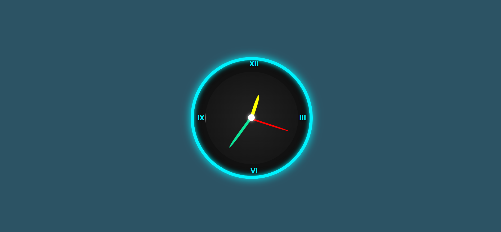

# 🕰️ Responsive Analog Clock

A sleek, animated, and fully responsive **analog clock** built with **HTML**, **CSS**, and **JavaScript**. This project features a custom clock face, dynamic hour/minute/second hands, and a center image, all beautifully styled with gradients and shadows.



---

## 🚀 Features

- 🕒 Functional analog clock with real-time updates
- 🖼️ Custom image inside the clock center
- 📱 Fully responsive (mobile, tablet, desktop)
- 🌈 Modern UI with gradients and shadows
- 💫 Smooth animations using `transform`
- ⚙️ Lightweight — no external libraries needed

---

## 🛠️ Tech Stack

| Technology | Description |
|------------|-------------|
| HTML5 | Markup structure |
| CSS3 | Custom styles, gradients, and responsiveness |
| JavaScript | Time updates for rotating clock hands |

---

## 📂 Folder Structure

responsive-clock/

├── index.html # Main page

├── clk.css # Styling (CSS)

├── clk.js # Clock logic (JavaScript)

└── images/

└── hari.jpg # Center image

└── clock-preview.png # Screenshot for README


---

## 📸 Screenshot

### 🖼️ Live Clock Demo

[🎬 Watch Clock Video](clock.mp4)


---

## ⚙️ Getting Started

### 📥 Clone the repository

```bash
git clone https://github.com/Harishna-K/clockproject.git

cd clockproject

💻 Open in Browser
You can simply open index.html in your browser:
start index.html

💡 You can also use Live Server in VS Code for auto-reload.

✏️ Customization
Replace images/hari.jpg with your own center image.

Update clock-preview.png with a new screenshot of your version.

Change the color scheme or hand styles in clk.css.

📬 Contact
Made with 💙 by Harishna K

GitHub Profile: https://github.com/Harishna-K

Email: harishna.gkc@gmail.com.com

📄 License
This project is licensed under the MIT License. Feel free to use, modify, or distribute.


